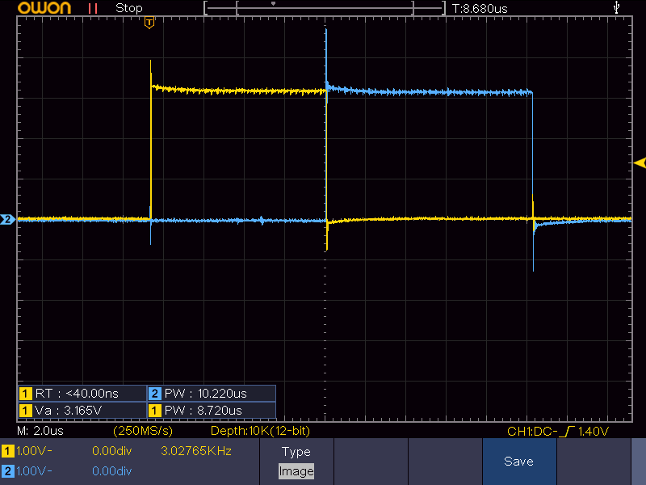

2025-02-23
# Atmega808 blinky

## Yksinkertainen demo Atmega808-sirun paljaan raudan ohjelmointiin

Ostin taannoin kasan Atmega808-siruja, mutten saanut niitä ohjelmoitua. Tein kehityskortin ja opettelin ohjelmoimaan siruja UPDI:llä. Tässä tiivistelmä prosessista.

## PCB
Kehityskortti on yksinkertainen, käytännössä pelkkä pinout sirun pinneille. Sirun lähellä on käyttökelpoiset portit jaoteltuna (PORTA, PORTC, PORTD, PORTF). Portin eka pinni on portin nimen päädyssä, korostettuna.
Kortin reunalla on ei-GPIO:t ominaisuudet, lähinnä virransyöttö- ja ohjelmointipinnit. Vin on ohjattu jänniteregulaattorin sisääntuloon ja 3.3 regulaattorin ulostuloon, joka myös yhteydessä sirun VDD:hen. Toisin sanottuna sirua voi ajaa myös syöttämällä virtaa suoraan 3.3-pinniin. Samannimiset pinnit on yhteydessä toisiinsa.
Kortin gerberit on pcb-kansion alla, ymmärtääkseni niillä saa tilattua suoraan PCBWayltä tai vastaavasta mestasta.

</img>

## Sirun ohjelmointi
Sirun ohjelmointirajapinta on UPDI. Se on siitä näppärä, että se on käytännössä sarjaporttiprotokolla, mutta yhdellä pinnillä. Toisin sanottuna on ohjelmia joilla sirun kanssa voi jutella standardilla sarjaportilla, esim. Raspberry pin sarjaporttipinneillä, kunhan kytkee TX ja RX väliin diodin (saadaan yhdestä pinnistä kaksisuuntaista kommunikointia).
Käytin Microchipin virallista(?) Python-pohjaista `pymcuprog`: https://github.com/microchip-pic-avr-tools/pymcuprog
Se on erittäin helppokäyttöinen, kunhan muistaa kirjoittaessa laittaa mukaan flagin `--erase`, eli
```
pymcuprog write --erase -d atmega808 -t uart -u /dev/ttyAMA0 -c 115200 -f ulostulo.hex
```

Käytin vähän turhan monta tuntia debuggaamiseen kun koodi näytti kääntyvän ja siru ohjelmoituvan, mutta mitään ei näkynyt skoopissa...
Kytkentäkaavio on esitetty alla.

</img>

Piirilevy peittää osan, mutta sen alla 3.3-pinni on kytketty raspin 3.3 V ulostuloon ja GND maahan.
Raspin TX- ja RX-pinnien välissä on diodi, katodi TX-pinniin (P8) päin ja anodi RX-pinniin (P10). En vieläkään ihan hiffaa miksi se toimii näin päin (eikö pitäisi olla just toiste päin..?), mutta kerta se pelittää ja toiste päin ei pelitä niin en tähän koske.

## Koodin kääntäminen
Kääntäminen on tosi helppoa jos käyttää Windowsia ja Microchip Studiota, ja aika mutkaista raspilla. AVR-GCC on jotenkin tosi jäljessä kaikesta mitä Microchip puuhastelee, eikä Atmega808 ole suoraan tuettu siru.
Käytännössä ongelma on se, että GCC:n kirjastoissa ei ole sirulle oikeita headereita, eli ei voi esim. `#include <avr/io.h>` mikä hidastaa hommailua aika tosi tehokkaasti. Itse ylätason arkkitehtuuri on toki tuettu (`avrxmega3` IIRC), eli VOI vaan tehdä omat headerit ja kirjoitella rekistereihin suoraan näiden muistiosotteiden perusteella.
Microchipin omat määritelmät on onneksi netissä vapaasti ladattavissa, eli ne voi sieltä kiskoa. <a href="https://www.avrfreaks.net/s/topic/a5C3l000000UZmfEAG/t151347">Tässä ketjussa</a> kuvattu koko asennusketju kivasti, mutta kokosin homman myös `Makefile` puolelle.

Tiivistettynä versiona:
- AVR-GCC ymv. tarvittavat työkalut pitää tietty olla asennettuna, esim. `sudo apt-get install gcc build-essential gcc-avr binutils-avr avr-libc gdb-avr` hyvä kokonaisuus
- Vaikka AVR-GCC on asennettuna, osa siruista on yhä määrittelemättä
  - Tarvitsee kiskoa oikea ATPACK <a href="http://packs.download.atmel.com">valmistajan sivuilta</a>, tässä tapauksessa ATmega-kokoelma `Atmel.ATmega_DFP.2.2.509.atpack`
  - ATPACK on oikeasti zippi, unzipataan omaksi kansiokseen
  - Kopioidaan kansiosta tiedosto `specs-atmega808` avr-libin kansioon `device-specs` (omalla koneella: `/lib/gcc/avr/5.4.0/device-specs`)
  - Kopioidaan kansiosta libratiedostot `libatmega808.a` ja `crtatmega808.o` avr-libin kansioon `lib` (omalla koneella: `/lib/gcc/avr/5.4.0/lib/avrxmega3/short-calls`)
  - Kerrotaan kääntäjälle mistä puuttuvat headerit löytyy (nääkin varmaan sais jotenkin automaagisesti löytyvään paikkaan..?)
    - `-B ATPACK_KANSIO/gcc/dev/atmega808` (?? täällä on vain tiedostoja jotka on jo kopioitu..?)
    - `-isystem ATPACK_KANSIO/include` headerin `<avr/iom808.h>` hakuun

Kopiointiin löytyy yksinkertainen bash-skripti `xfer-pack.sh` joka ottaa ekana argumenttina puretun ATPACK-kansion ja tokana gcc:n librakansion (esim. `/lib/gcc/avr/5.4.0`)

Esimerkiksi väsäsin "laajennetun blinkyn", joka vetää GPIO-pinneistä kunkin vuorollaan ylös. Kortti kun on käsin kolvattu niin hyvä keino skoopilla tarkistaa että onhan kaikki kontaktit kunnossa.
Kunhan on `avr-gcc` tarpeeksi uutena versiona asennettuna, pitäisi `make` hoitaa homma loppuun: se
- Kiskoo Microchipin sivuilta Atmega808 määritykset (device-spec, io-headerit ymv)
- Tuuppaa speksitiedostot paikalleen GCC:n librakansioon
- Kääntää koodin käyttäen include-kansion sisältöä tukena

Katso Makefilen sisältä yksityiskohdat, ja tarkista että kansiot ja avr-gcc-kutsu on oikein.
Bonuksena mukana on send-vaihtoehto, eli `make send` kääntää ja lähettää käännetyn koodin sirulle.
Jos koodi toimii, skoopilta kun katsoo kahden vierekkäisen pinnin signaalia niin pitäisi näyttää suunnilleen tältä

</img>
